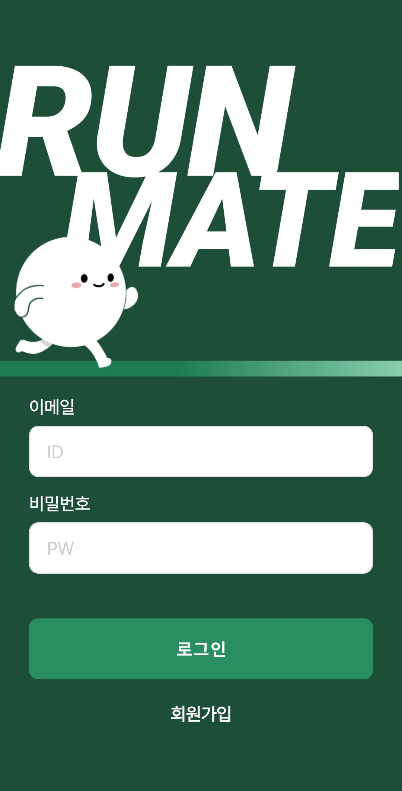
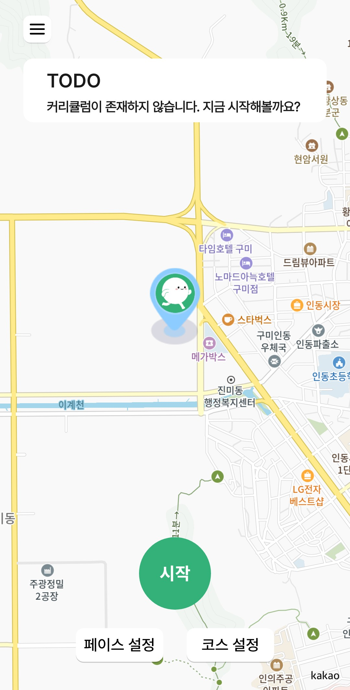
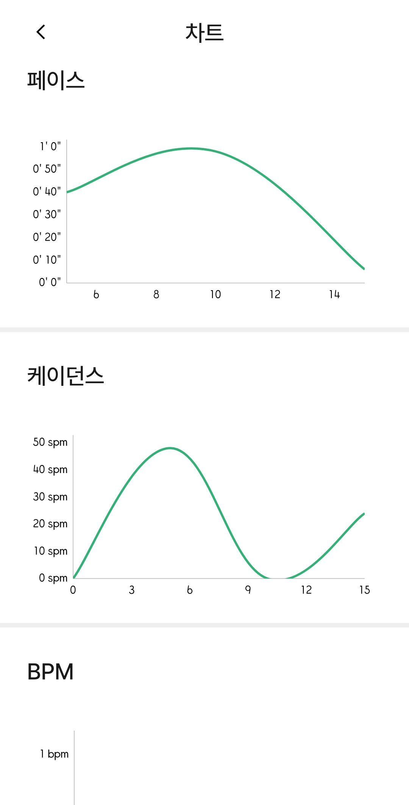

# 💗 **싸피 12기 2학기 자율 프로젝트**

## 당신의 발걸음을 책임질 마라톤 파트너 [런메이트]

- 팀명 : **달려라화니**
- 팀원 : **정찬우, 김환, 이한나, 김미경, 한아영, 황선혁**

**개발 기간** : `2025/04/14(월) ~ 2025/05/22(목)`

## 🏃‍➡️ 캐릭터 소개

## 목차

1. [팀원 소개](#팀원-소개)
2. [기술 스택](#기술-스택)
3. [서비스 소개](#서비스-소개)
4. [주요 기능 상세설명](#주요-기능-상세설명)
5. [AI 활용내역](#AI-활용내역)
6. [맡은 역할](#맡은-역할)
7. [산출물](#산출물)

## 📌팀원 소개

### D107 - 달려라화니

| 이름       | 역할 | 파트                  |
| ---------- | ---- | --------------------- |
| **정찬우** | 팀장 | Backend, AI Prompt    |
| **김환**   | 팀원 | Backend, Infra        |
| **이한나** | 팀원 | Backend, Crawling     |
| **김미경** | 팀원 | Android, Smart Watch  |
| **한아영** | 팀원 | Android, UI/UX Design |
| **황선혁** | 팀원 | Android, IoT          |

## 📌기술 스택

### 백엔드

### 인프라

### 안드로이드

### AI

### 디자인

### 협업 도구

## 📌서비스 소개

### 1. 기획의도

> "당신의 발걸음을 책임질 마라톤 파트너, RunMate"

RunMate는 마라톤을 목표로 하는 사용자를 위해 AI 기반 훈련 커리큘럼을 제공하고,
위치 기반 그룹 러닝과 음성 피드백, 스마트워치 연동까지 지원하는 올인원 러닝 파트너 앱입니다.

- 개인 맞춤형 훈련 계획 자동 생성
- 실시간 그룹 러닝 및 음성 피드백
- 삼성 갤럭시 워치 연동
- AI 추천 기반 러닝 스케줄링 및 리포트 제공

### 2. 주요 기능(서비스)

**1. AI 훈련 커리큘럼 자동 생성**

- GPT 기반 프롬프트로 사용자의 목표, 경험, 기간에 맞는 맞춤형 훈련 계획 제공

**2. 그룹 러닝 기능**

- WebSocket 기반 실시간 위치 공유
- 초대코드로 그룹 참여
- 그룹 진행 상황 실시간 모니터링

**3. 러닝 데이터 제공**

- 달린 시간, 칼로리, 평균 케이던스, 평균 페이스, 평균 BPM, 평균 고도 기록

**4. 삼성 갤럭시 워치 연동**

- 실시간 거리, 페이스, 심박 수 측정
- 스마트폰-워치 연동으로 러닝 데이터 통합 분석

## 📌주요 기능 상세설명

### 1. 로그인 및 회원가입

사용자는 간편한 로그인과 회원가입을 통해 RunMate 서비스를 이용할 수 있습니다.

- **로그인**: 기존 계정으로 로그인하여 개인화된 러닝 경험 제공
- **회원가입**: 개인정보 입력을 통해 맞춤형 AI 커리큘럼 생성 기반 마련

<table>
<tr>
<td></td>
<td></td>
<td></td>
</tr>
</table>

### 2. 메인 러닝 화면

실시간 러닝 데이터를 확인하고 러닝을 시작/일시정지할 수 있는 핵심 화면입니다.

- **메인 화면**: 러닝 시작 전 메인 화면
- **러닝 중**: 실시간 거리, 시간, 페이스, 칼로리 등 러닝 데이터 표시
- **일시정지**: 러닝 중 일시정지 시 현재 상태 유지
- **페이스 설정**: 목표 페이스 설정으로 안정적인 러닝 지원

<table>
<tr>
<td></td>
<td></td>
<td></td>
<td></td>
</tr>
</table>

### 3. 코스 선택 및 관리

다양한 러닝 코스를 선택하고 관리할 수 있습니다.

- **코스 리스트**: 추천 코스와 사용자 생성 코스 목록 제공
- **코스 상세**: 코스 정보, 경로, 고도 등 상세 정보 확인
- **최근 달린 코스**: 최근 이용한 코스 빠른 접근
- **내가 만든 코스**: 사용자가 직접 생성한 코스 바로가기
- **코스 선택**: 코스 선택한 후 메인화면에 경로 표시

<table>
<tr>
<td></td>
<td></td>
<td></td>
<td></td>
<td></td>
</tr>
</table>

### 4. AI 매니저 기능

GPT 기반 AI가 사용자에게 맞춤형 마라톤 훈련 커리큘럼을 제공합니다.

- **AI 매니저 메인화면**: 목표에 맞춰 AI가 생성한 커리큘럼 표시
- **목표 설정**: 목표 마라톤 검색 혹은 목표 날짜, 현재 실력 등 입력
- **커리큘럼 생성**: AI가 분석한 맞춤형 훈련 스케줄 제공
- **커리큘럼 변경**: 커리큘럼 새로 만들기

<table>
<tr>
<td></td>
<td></td>
<td></td>
<td></td>
</tr>
<tr>
<td></td>
<td></td>
</tr>
</table>

### 5. 그룹 러닝 기능

친구들과 함께 실시간으로 러닝할 수 있는 그룹 기능을 제공합니다.

- **미가입 상태**: 그룹에 참여하지 않은 상태
- **그룹 메인**: 참여 중인 그룹 및 상태 확인
- **그룹 생성**: 새로운 러닝 그룹 생성
- **초대코드 가입**: 초대코드를 통한 그룹 참여
- **초대코드 공유**: 그룹 초대코드 공유 기능

<table>
<tr>
<td></td>
<td></td>
<td></td>
<td></td>
<td></td>
</tr>
</table>

### 6. 러닝 히스토리 및 분석

과거 러닝 기록을 확인하고 성과를 분석할 수 있습니다.

- **히스토리 메인**: 전체 러닝 기록 목록
- **히스토리 필터**: 날짜, 거리, 시간 등 조건별 필터링
- **그룹원 정보**: 그룹 러닝 시 다른 멤버들의 기록 확인
- **차트 분석**: 러닝 데이터 시각화 및 트렌드 분석

<table>
<tr>
<td></td>
<td></td>
<td></td>
<td></td>
</tr>
</table>

### 7. 스마트워치 연동

삼성 갤럭시 워치와 연동하여 더욱 정확한 러닝 데이터를 수집합니다.

- **달리기 중 화면**: 워치에서 실시간 러닝 데이터 확인
- **페이스 설정**: 워치에서 목표 페이스 설정
- **일시정지 화면**: BPM, 시간 등 상세 정보 표시
- **러닝 기록**: 워치에서 간편하게 러닝 기록 확인

<table>
<tr>
<td></td>
<td></td>
<td></td>
<td></td>
<td></td>
</tr>
<tr>
<td></td>
<td></td>
<td></td>
<td></td>
<td></td>
</tr>
</table>

### 8. 스마트 인솔 연동

스마트 인솔을 통한 발걸음 분석으로 더욱 정확한 러닝 데이터를 제공합니다.

- **메인 화면**: 스마트 인솔 연결 상태 및 기본 정보
- **블루투스 페어링**: 스마트 인솔과의 연결 설정
- **페어링 성공**: 연결 완료 상태
- **진단 시작**: 발걸음 분석 시작
- **분석 결과**: 상세한 발걸음 분석 데이터 제공

<table>
<tr>
<td></td>
<td></td>
<td></td>
</tr>
<tr>
<td></td>
<td></td>
<td></td>
</tr>
</table>

## 📌AI 활용내역

### GPT 기반 AI 커리큘럼 생성

RunMate의 AI 매니저는 GPT-4.1 모델을 활용하여 사용자 맞춤형 마라톤 훈련 커리큘럼을 생성합니다.

- GPT-4.1과 다른 버전 비교

  - GPT-3.5: Structured Outputs 지원하지 않음, 정확도 낮음
  - GPT-4: 더 비싸고, 이 용도에는 과도함
  - GPT-4.1: 적절한 가격대비 성능, Structured Outputs 지원

- 실시간 응답 처리

  - 사용자가 커리큘럼 생성 요청 시 즉시 응답 필요
  - GPT-4.1의 빠른 처리 속도 활용

- 결론: 마라톤 훈련 커리큘럼이라는 전문적이고 정확성이 중요한 도메인에서 구조화된 출력이 필요하기 때문에 GPT-4.1을 선택

**주요 활용 분야:**

- 사용자의 현재 실력과 목표 분석
- 개인별 맞춤형 훈련 스케줄 생성
- 러닝 강도 조절 및 훈련 계획 조정
- 실시간 피드백 및 조언 제공

### 데이터 분석 및 예측

수집된 러닝 데이터를 분석하여 사용자의 성과 향상을 도모합니다.

**분석 항목:**

- 페이스, 거리, 시간 등 러닝 성과 분석
- 심박수, 케이던스 등 생체 데이터 분석
- 발걸음 패턴 분석 (스마트 인솔 연동)
- 개선점 및 권장사항 제시

## 📌맡은 역할

### 정찬우 (팀장)

- **Backend 개발**: Spring Boot 기반 REST API 개발
- **AI Prompt 설계**: GPT-4.1 기반 커리큘럼 생성 프롬프트 설계
- **프로젝트 관리**: 팀 전체 일정 관리 및 의사결정

### 김환

- **Backend 개발**: Spring Boot 서버 개발
- **인프라 구축**: Docker, AWS, Jenkins CI/CD 파이프라인 구축
- **데이터베이스 설계**: PostgreSQL 스키마 설계 및 최적화

### 이한나

- **Backend 개발**: Spring Boot API 개발
- **크롤링 시스템**: 마라톤 정보 수집 및 데이터 처리
- **데이터 분석**: 러닝 데이터 분석 및 통계 처리

### 김미경

- **Android 개발**: 메인 앱 개발 및 UI 구현
- **스마트워치 연동**: 삼성 갤럭시 워치 앱 개발
- **실시간 데이터 처리**: 워치-폰 간 데이터 동기화

### 한아영

- **Android 개발**: 사용자 인터페이스 및 사용자 경험 설계
- **UI/UX 디자인**: Figma를 활용한 앱 디자인
- **프론트엔드 로직**: 앱 내 비즈니스 로직 구현

### 황선혁

- **Android 개발**: 앱 기능 구현
- **IoT 연동**: 스마트 인솔 하드웨어 연동
- **블루투스 통신**: 센서 데이터 수집 및 처리

## 📌산출물

### 1. 소프트웨어 산출물

- **Android 앱**: RunMate 메인 애플리케이션
- **스마트워치 앱**: 삼성 갤럭시 워치용 러닝 앱
- **Backend API**: Spring Boot 기반 REST API 서버
- **크롤링 시스템**: Python 기반 마라톤 대회 정보 수집 시스템
- **IoT 펌웨어**: 스마트 인솔용 Arduino 펌웨어

### 2. 문서 산출물

- **프로젝트 기획서**: 서비스 기획 및 요구사항 정의
- **기술 명세서**: 시스템 아키텍처 및 기술 스택 문서
- **API 문서**: REST API 명세서
- **사용자 매뉴얼**: 앱 사용 가이드
- **시연 시나리오**: 프로젝트 발표용 시연 시나리오

### 3. 인프라 산출물

- **Docker 컨테이너**: 애플리케이션 배포용 컨테이너
- **CI/CD 파이프라인**: Jenkins 기반 자동화 배포 시스템
- **클라우드 인프라**: AWS 기반 서버 인프라
- **데이터베이스**: PostgreSQL 데이터베이스 스키마

### 4. 디자인 산출물

- **UI/UX 디자인**: Figma 기반 앱 디자인
- **아이콘 및 이미지**: 앱 내 사용되는 그래픽 요소
- **프로토타입**: 사용자 플로우 및 인터랙션 프로토타입
